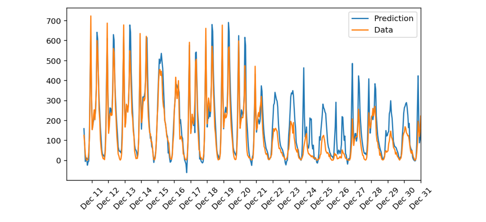
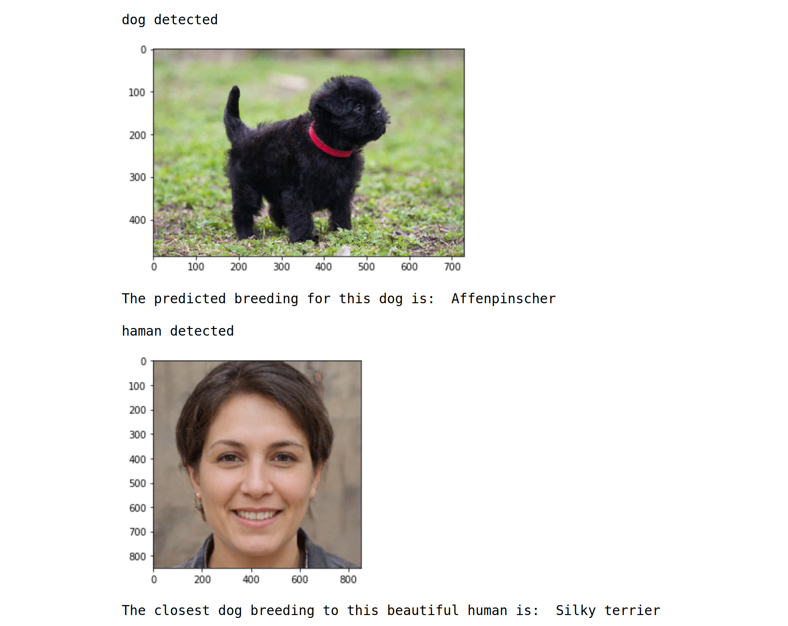
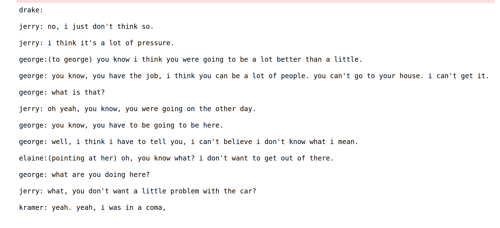
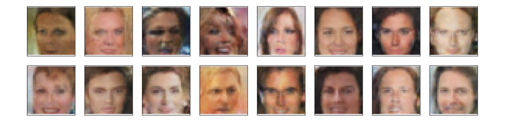

# &#x1F4D8; Udacity Deep Learning Nanodegree Projects

These are my five projects implemented during the Udacity Deep Learning Nanodegree Program (2020).
 
  
## 1. Predicting Bike-Sharing Data

In this project, I built a neural network from scratch (using numpy) to carry out a prediction on a Bike Sharing Dataset.

You can access the data set from here: Bike Sharing Dataset Data Set
https://archive.ics.uci.edu/ml/datasets/Bike+Sharing+Dataset

Screenshot below shows the prediction vs the real data.

## 2. Convolutional Neural Network (CNN) project

In this project, I built a pipeline to process real-world, user-supplied images. Given an image of a dog, this algorithm will predict the dog's breeding. 
If supplied an image of a human face, the code will give the resembling dog breed. Examples are shown below.

## 3. Generate TV Scripts

In this project, I generated my own "fake" TV scripts using RNNs (lstm). 
A sample of a fake tv script is shown below.

## 4.Face Generation

In this project, I used generative adversarial networks (GANs) to generate new faces. Example of the generated faces are shown below.

## 5. SageMaker deployment project (AWS SageMaker)

This is project is intended to teach us how to build and deploy DL and ML models using cloud computing frameworks such as AWS. 
In this project, I constructed a recurrent neural network for the purpose of determining the sentiment of a movie review using the IMDB data set. I created this model using Amazon's SageMaker service. 
In addition, I deployed my model and construct a simple web app which interacts with the deployed model.
